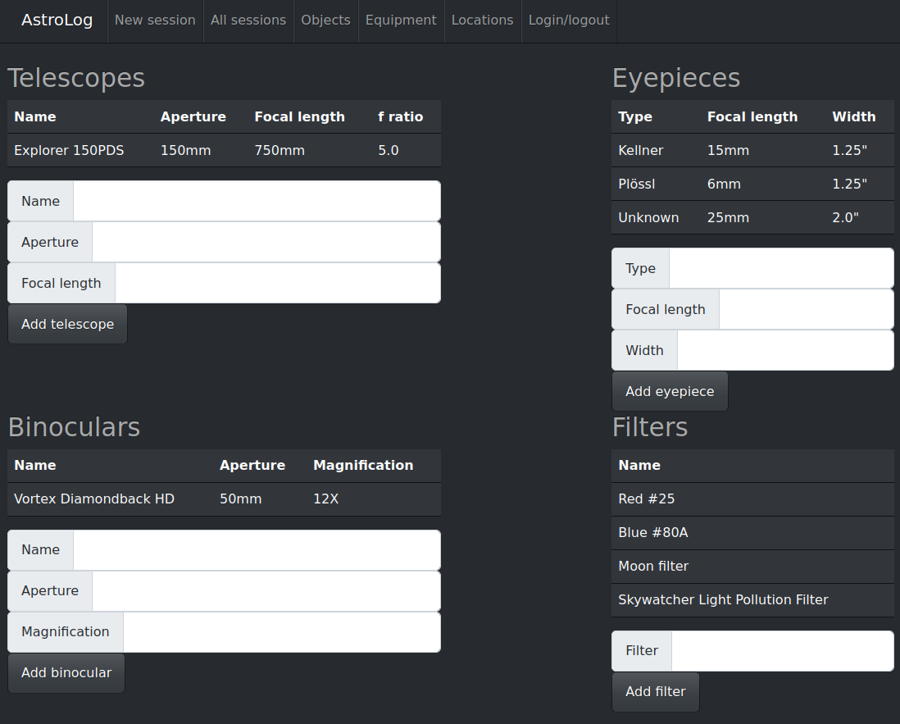
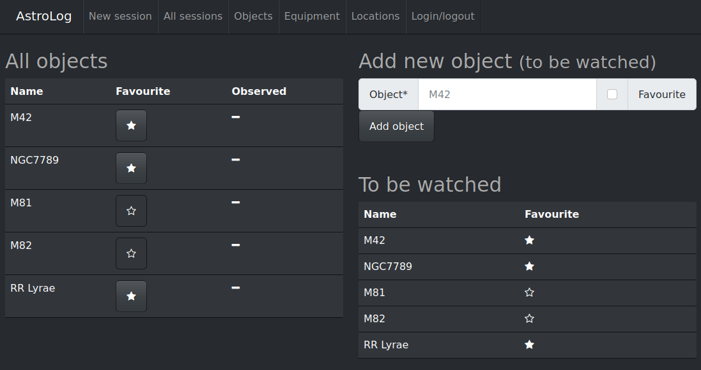
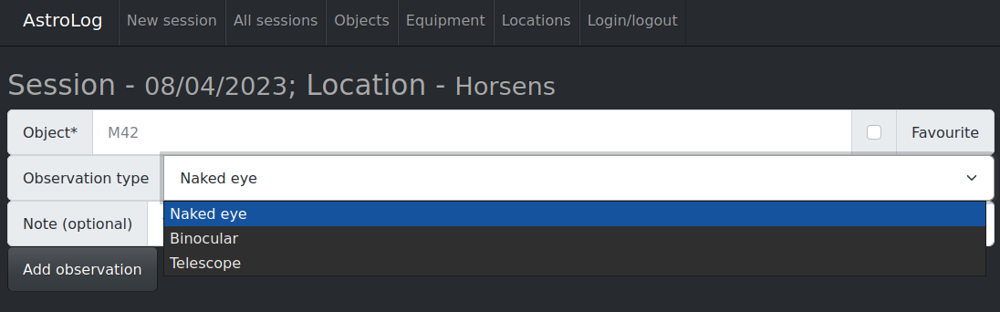
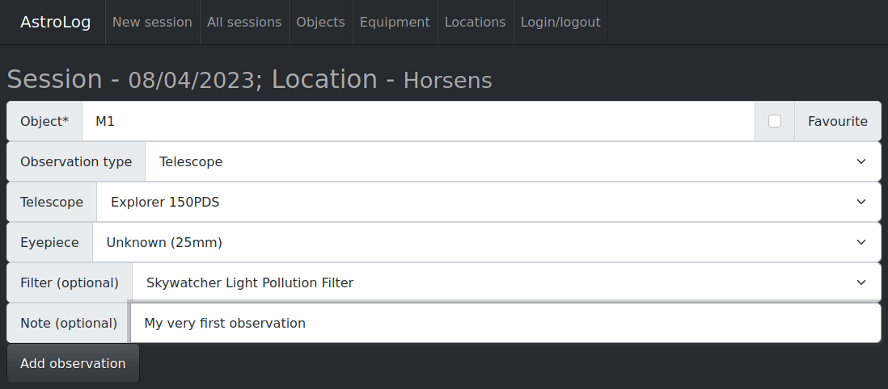
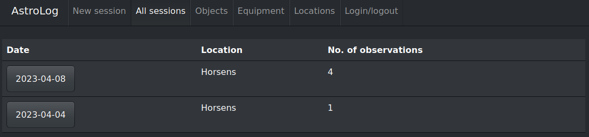
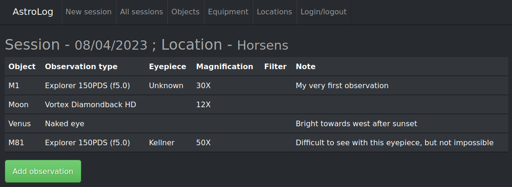

# Astro log
Website to implement logs for (amateur) astronomical observations.

# Screenshots

# Getting started
## Without docker

Create a virtualenv with `virtualenv -p pythton3 venv` and activate it
with `source venv/bin/activate`.

Install dependencies with e.g. `pip install -e .` which also allows
development.

Run the tests (optional, but good sanity check) with `pytest --cov=astrolog --cov-report term-missing`.

Run the web application with `python src/astrolog/web/app.py` and follow
the instructions from the prompt.

# With docker
Just do `docker-compose up -d` and go to http:localhost:5065
